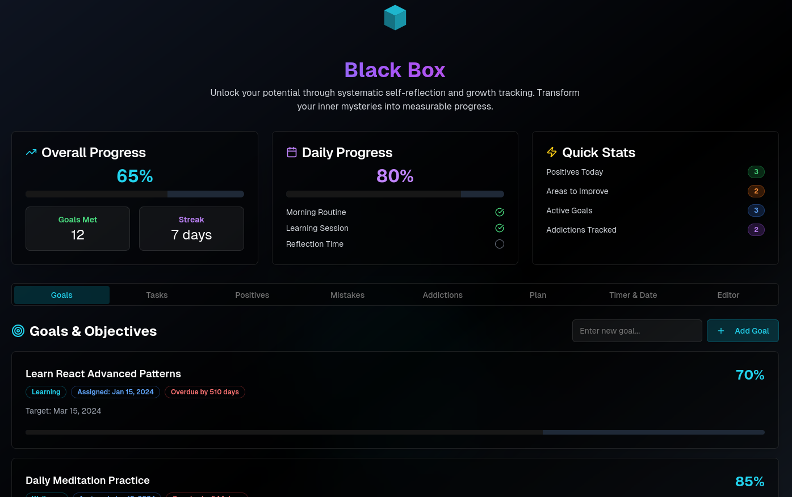

<a href="https://locamartin.github.io/blackbox">
     
     <h1><a href="res/BLACK_BOX.md">BLACK BOX</a></h1>
     <h3>Personal Development App</h3>
</a>

A sophisticated personal development tracking application comprehensive self-improvement tools.

> [!NOTE]
> **What is blackbox effect ?**
> 
> The Black Box Effect refers to the unconscious mental processing that happens
> between an event and your reaction where hidden thoughts, emotions, and
> beliefs shape your response without you realizing it.
> Opening this “black box” helps you learn and grow from mistakes instead of
> repeating them.

> [!important]
> - Click on the icon/logo to use it
> - Click on the blackbox "BLACK BOX" to learn more about black box effect

<table>
  <tr>
    <td><a href="res/BLACK_BOX.md">BLACK BOX</a></td>
    <td><a href="res/DEV.md">DOC FOR DEV</a></td>
    <td><a href="res/USER_MANUAL.md">USER MANUAL</a></td>
  </tr>
</table>

### Features

- **Goal Tracking** - Set and monitor progress on personal objectives
- **Task Management** - Nested tasks with checkboxes and numbering
- **Daily Progress** - Track daily achievements and routines  
- **Reflection Tools** - Log positives, mistakes, and learnings
- **Habit Management** - Monitor and overcome addictions/bad habits
- **Focus Timer** - Built-in stopwatch for time tracking
- **Rich Text Editor** - Advanced note-taking capabilities
- **Local Data Storage** - All data stays in your browser
- **Password Protection** - Secure access to your personal data
- **Glassmorphism UI** - Beautiful, modern interface design

### Security & Privacy

- **Local Storage Only**: All user data is stored locally in the browser
- **No External APIs**: No data is sent to external servers
- **Password Protection**: Access is secured with a login system
- **Client-Side Only**: Runs entirely in the browser

### Browser Compatibility

- Chrome 90+ , Firefox 88+ , Safari 14+ , Edge 90+

### Support

If you encounter any issues:

1. Check the [Issues](https://github.com/LocaMartin/blackbox/issues) page
2. Create a new issue with detailed information
3. Include browser version and error messages

---

<h4 align="center">
Built with  for personal growth and self-improvement
</h4>

---